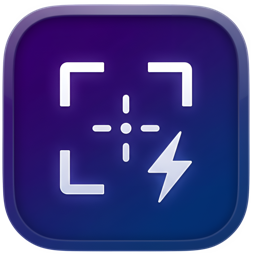

<p align="center">
  
</p>

<h1 align="center">SnapForge</h1>

<p align="center">
  <strong>The beautiful, blazing-fast, fully native Mac app for screenshots, screen recordings, annotation, and editing.</strong>
</p>

<p align="center">
  <a href="https://github.com/nhtera/SnapForge-releases/releases/latest">
    
  </a>
  
  
</p>

---

## ✨ Features

### 📸 Screenshot Capture
- **Area Capture** — Select any region of your screen
- **Window Capture** — Capture any application window with a click
- **Fullscreen Capture** — Grab the entire screen instantly
- **Self-Timer Capture** — Timed area capture for menus and tooltips
- **OCR Capture** — Extract text from any area using on-device Vision
- **Scroll Capture** — Capture long pages beyond the visible viewport

### 🎬 Screen Recording
- Record screen area or full screen as video
- GIF export support
- Recording toolbar with timer and controls
- Click and keystroke visualization overlays

### ✏️ Annotation Editor
- Draw, arrow, line, rectangle, ellipse, text, highlight, blur tools
- Undo/redo support
- Export to PNG, JPG, WebP, HEIC
- Zoom and pan navigation

### 🎨 More Tools
- **Color Picker** — Pick any color from your screen
- **Floating Pins** — Pin screenshots as always-on-top overlays
- **Quick Access** — Post-capture overlay with instant actions (copy, save, annotate, pin)
- **Quick Blur** — One-click blur sensitive content
- **Quick Mockup** — Add device frames to screenshots
- **Auto Redact** — Automatically detect and redact sensitive text
- **History Browser** — Browse and manage all captures

### ⚡ Built for Speed
- 100% native Swift + SwiftUI + AppKit — no Electron, no web views
- Menu-bar-only app — stays out of your way
- Global keyboard shortcuts for instant capture
- Sparkle auto-updates from public releases

---

## ⌨️ Keyboard Shortcuts

| Shortcut | Action |
|----------|--------|
| `⌘⇧4` | Capture Area |
| `⌘⇧3` | Capture Fullscreen |
| `⌘⇧W` | Capture Window |
| `⌘⇧5` | Self-Timer Capture |
| `⌘⇧O` | OCR Capture |
| `⌘⇧S` | Scroll Capture |
| `⌘⇧C` | Color Picker |

---

## 📥 Installation

### Download

1. Download the latest DMG from [**Releases**](https://github.com/nhtera/SnapForge-releases/releases/latest)
2. Open the DMG and drag **SnapForge** to your Applications folder
3. **Important** — Run this command in Terminal to remove the quarantine flag:

```bash
xattr -cr /Applications/SnapForge.app
```

4. Launch SnapForge from Applications
5. Grant **Screen Recording** permission when prompted (required for capture)

> [!NOTE]
> The `xattr -cr` command is required because the app is not notarized with an Apple Developer ID certificate. This removes the macOS quarantine attribute that would otherwise block the app from launching.

### Auto-Updates

SnapForge includes built-in auto-update support via [Sparkle](https://sparkle-project.org/). You'll be notified when new versions are available, or you can check manually from **Settings → About → Check for Updates**.

---

## 🛠 Build from Source

### Requirements

- macOS 15.0+
- Xcode 26.0+
- [XcodeGen](https://github.com/yonaskolb/XcodeGen)

### Steps

```bash
# Clone the repository
git clone https://github.com/nhtera/SnapForge.git
cd SnapForge

# Install XcodeGen (if not already installed)
brew install xcodegen

# Generate the Xcode project
xcodegen generate

# Open in Xcode
open SnapForge.xcodeproj

# Build and run (⌘R)
```

### Build DMG for Distribution

```bash
./scripts/build_dmg.sh
```

---

## 🏗 Tech Stack

| Layer | Technology |
|-------|-----------|
| Language | Swift 6.0 (strict concurrency) |
| UI | SwiftUI + AppKit |
| Capture | ScreenCaptureKit |
| Recording | AVAssetWriter + SCStream |
| Annotation | SwiftUI Canvas + Core Graphics |
| OCR | Apple Vision framework |
| Updates | Sparkle |
| Project | XcodeGen |

---

## 📁 Project Structure

```
SnapForge/
├── App/                    # Entry point, AppCoordinator, AppEnvironment
├── Features/               # Feature modules
│   ├── Annotation/         # Image annotation editor
│   ├── Capture/            # Screenshot capture flow
│   ├── FloatingPin/        # Always-on-top pinned screenshots
│   ├── History/            # Capture history browser
│   ├── Onboarding/         # First-launch permission flow
│   ├── QuickAccess/        # Post-capture overlay
│   ├── Recording/          # Screen recording + GIF
│   ├── ScrollCapture/      # Scrolling screenshot capture
│   ├── Settings/           # Preferences window
│   └── VideoEditor/        # Video editing
├── Services/               # Shared services
├── Shared/                 # Models, components, extensions, styles
└── Resources/              # Assets, Info.plist, localization
```

---

## 🌐 Localization

SnapForge supports:
- 🇺🇸 English
- 🇻🇳 Tiếng Việt

---

## 📄 License

This project is private. All rights reserved.

---

<p align="center">
  Built with ❤️ by <a href="https://github.com/nhtera">Tien Nguyen</a>
</p>
